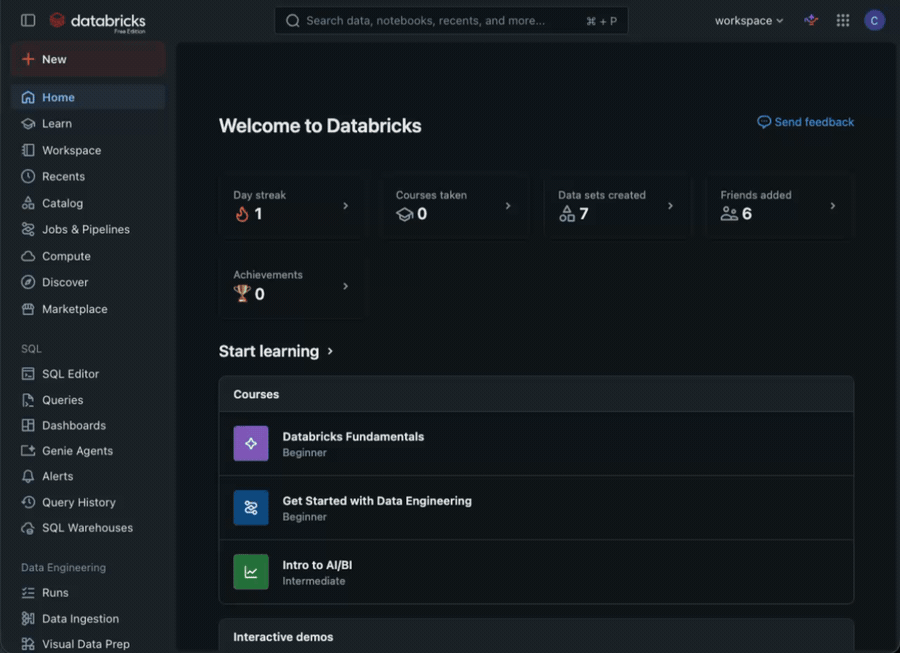
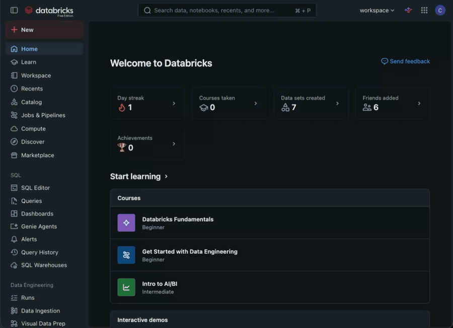
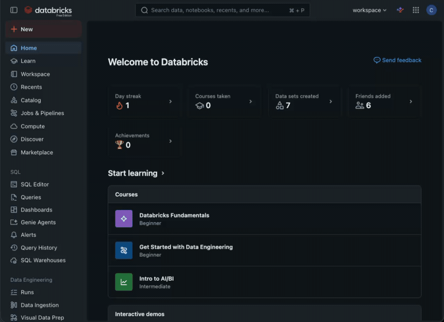

# Guia de Setup — Hackathon Terra Signal

Passo a passo para preparar tudo no **primeiro dia**. Siga na ordem. Se travar em
algum ponto, chame um organizador — não perca tempo (veja também o aviso de
**consumo** no fim, que já custou um dia a uma equipe numa edição passada).

---

## 0. Antes de começar

- Uma pessoa da equipe será a **dona do workspace** (cria a conta e convida o resto).
- Tenham em mãos: os e-mails de todos os integrantes e as contas do GitHub de todos os integrantes.

---

## 1. Criar conta e workspace no Databricks Free Edition

1. Crie uma conta **Free Edition** (use o QR code / link do slide).
2. Confirme o e-mail e entre no workspace.
3. **Um workspace por equipe** — só a pessoa dona cria; os demais entram como colaboradores (passo 4).

---

## 2. Fork do repositório

1. Abra **https://github.com/CEDipEngineering/Hackathon_Terra_Signal**.
2. Clique em **Fork** (canto superior direito) → **Create fork**. O fork fica em `github.com/SUA-CONTA/Hackathon_Terra_Signal`.
3. Esse fork é o repositório **da sua equipe** — todo o código entra nele.

---

## 3. Conectar o GitHub ao Databricks (credenciais Git)

**IMPORTANTE! Somente o dono do workspace deve fazer isso**
Para o Databricks ler/escrever no seu fork, conecte sua conta GitHub uma vez:

1. No Databricks, canto superior direito → **Settings**.
2. **Linked accounts** (ou **Git integration**) → **Git provider: GitHub**.
3. Conecte via **Personal Access Token (PAT)** do GitHub:
   - No GitHub: **Settings → Developer settings → Personal access tokens → Tokens (classic) → Generate new token**, com o escopo **`repo`**.
   - Cole o token no Databricks e salve.

---

## 4. Adicionar a equipe ao workspace

1. Ícone do perfil (canto sup. direito) → **Settings** → **Identity and access** → **Users** → **Add user**.
2. Adicione o e-mail de cada integrante. Selecione a permissão de "Workspace Admin".

---

## 5. Clonar o fork dentro do Workspace

1. Na barra lateral → **Workspace** → botão **Create** → **Git folder** (antigo "Repos").
2. Cole a URL do **seu fork** (`https://github.com/SUA-CONTA/Hackathon_Terra_Signal`).
3. **Create**. A pasta aparece com todos os arquivos do repositório.

---

## 6. Identifique a equipe no README

Edite o `README.md` **do seu fork** e preencha o nome da equipe e os integrantes
(há um bloco `## Equipe` pronto no fim do README). Depois **commit + push**.

---

## 7. Desenvolva

- `NOTEBOOK.ipynb` é o ponto de partida: lê `history.csv`, salva no Unity Catalog,
  e mostra como gerar o arquivo de previsão.
- Treine seu modelo com `history.csv` (coluna alvo = `Churn`).
- Gere previsões para `inference.csv` (que **não** tem a coluna `Churn`).
- Salve o resultado como **`prediction_<NOME_DA_EQUIPE>_<timestamp>.csv`** — exatamente
  como no `NOTEBOOK.ipynb`. Manter esse padrão de nome facilita a avaliação.
- Faça **commit + push** com frequência para o seu fork.

> ⏰ Commits feitos **após o horário de encerramento não são considerados**.

---

## 8. Entrega

Envie pelo **Google Form** (link fornecido pelos organizadores):
1. O link do **seu fork** no GitHub.
2. O arquivo **`prediction_<equipe>_<timestamp>.csv`**.
3. Os **slides da sua apresentação**.

---

## ⚠️ Consumo e limites do Free Edition

O Free Edition tem **crédito limitado** — na edição passada, uma equipe esgotou o
crédito e ficou o resto do dia sem conseguir desenvolver. Para evitar isso:

- **Não deixe Apps nem endpoints de Model Serving ligados** sem necessidade —
  desligue quando não estiver usando.
- **Não rode tarefas pesadas** em notebooks. O dataset é pequeno (~7 mil linhas);
  se um job estiver demorando muito, provavelmente há algo errado — pare e revise.
- Leia os limites do Free Edition:
  **https://docs.databricks.com/aws/en/getting-started/free-edition-limitations**
